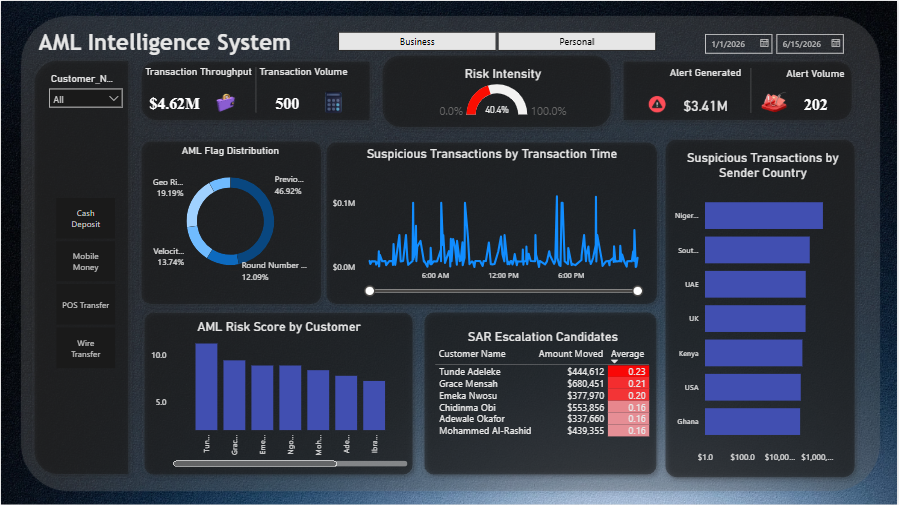

# Fintech AML Intelligence System - Transaction Risk Monitoring & SAR Analytics

End-to-end Anti-Money Laundering (AML) transaction monitoring system covering data cleaning, feature engineering, SQL compliance analysis, machine learning fraud detection, and an executive Power BI dashboard.

**Author:** Emmanuel Bitrus

**Tools:** Python (pandas, scikit-learn) · SQL (SQLite) · Power BI

**GitHub:** [bitrusemmanuel101-rgb](https://github.com/bitrusemmanuel101-rgb)

---

## Project Background

Money laundering moves through three stages: placement, layering, and integration. Fintechs are a common target for this activity because of transaction speed and cross-border reach, which is why regulators such as the CBN, NFIU, and FATF require institutions to monitor transactions, score customer risk, and file Suspicious Activity Reports (SARs) when warranted.

This project simulates that workflow end to end. A synthetic 500-transaction dataset was built across 10 customers, both Personal and Business accounts, spanning Nigeria and several international corridors including FATF-designated high-risk jurisdictions. Known red flag patterns (structuring, velocity abuse, geographic risk, round-number transactions) were deliberately planted so the system's detection logic could be tested against a known ground truth.

---

## Project Structure

```
AML_Intelligence_System/
├── data/
│   ├── AML_Dataset_Raw.xlsx              # Original dataset with planted data quality issues
│   ├── AML_Dataset_Clean.csv             # Post-cleaning dataset
│   └── AML_Dataset_Final_With_ML.csv     # Final dataset with all flags, risk scores, and ML predictions
├── notebooks/
│   └── aml_pipeline.ipynb                # Full Python pipeline: cleaning, feature engineering, ML
├── sql/
│   └── aml_queries.sql                   # All compliance SQL queries
├── dashboard/
│   └── AML_Intelligence_System.pbix      # Power BI dashboard
└── README.md
```

---

## Phase 1: Data Cleaning (Python)

The raw dataset (508 rows, 11 columns) was deliberately seeded with realistic data quality issues to demonstrate cleaning competency: [(View Python Validation and Feature engineering)](AML_Modeling_&_Analysis.ipynb)


| Issue | Count | Resolution |
|---|---|---|
| Missing `Transaction_Amount` | 15 | Filled with column median after removing dirty currency strings |
| Dirty currency strings (e.g. "5432.10 NGN") | 5 | Stripped non-numeric text, preserved the underlying value rather than discarding the row |
| Missing `Receiver_Country` | 10 | Filled with "Unknown" to preserve the transaction record |
| Duplicate rows | 8 | Identified and removed using exact row matching |
| Inconsistent `Account_Type` casing | 5 | Standardised using `.str.title()` |
| Incorrect data types | All | `Transaction_Date` and `Transaction_Time` converted to proper datetime objects |

**Result:** 500 clean transaction records, zero missing values, zero duplicates, correct data types throughout.

---

## Phase 2: Feature Engineering (Python)

Seven AML risk signals were engineered from the cleaned data:

**Customer Behavioural Baseline**
Each customer's personal average and standard deviation for daily transaction amount and count were calculated, rather than applying one flat threshold across all customers. This avoids penalising naturally high-volume customers and instead flags deviation from each customer's *own* normal behaviour.

**Velocity_Flag**
Flags a transaction when a customer's daily activity (amount or count) exceeds their personal baseline by more than 2 standard deviations.

**Structuring_Flag (dual-layer)**
- *Regulatory layer:* Flags amounts just under the CBN/NFIU Currency Transaction Report thresholds (₦5,000,000 for Personal, ₦10,000,000 for Business). This layer returned zero hits, since this dataset's transaction amounts (₦1,229–₦100,000) sit well below statutory reporting thresholds — a legitimate finding in its own right.
- *Policy layer:* An internally-calibrated threshold scaled to this dataset's actual transaction range, empirically validated against the dataset's ground truth labels before being adopted.
- The two layers are combined into a single `Structuring_Flag`, with 34 transactions flagged.

**Geo_Risk_Flag**
Flags transactions sent to FATF-designated high-risk or sanctioned jurisdictions (Iran, North Korea, Myanmar, Russia). 81 transactions flagged.

**Round_Number_Flag**
Flags transaction amounts that divide evenly by 1,000, a pattern associated with deliberate fund movement rather than organic spending. 51 transactions flagged.

**Previous_SAR_Flag**
Flags a transaction if the same customer's immediately preceding transaction was suspicious. 198 transactions flagged. Cross-tabulation against ground truth showed this feature had limited standalone predictive power in this dataset (42% suspicious rate when flag = 0 vs. 38% when flag = 1), most likely a reflection of how the synthetic labels were generated rather than a real-world pattern.

**AML_Risk_Score**
A composite score (0.0–1.0) combining all flags with weights reflecting severity: Geo_Risk (0.35), Structuring (0.25), Velocity (0.20), Previous_SAR (0.15), Round_Number (0.05). Transactions scoring ≥ 0.50 showed a 100% match rate against the ground truth suspicious label.

---

## Phase 3: SQL Compliance Analysis

All queries are in [AML_queries.sql](AML_queries.sql), run against a SQLite database built directly from the featured dataset.

**Headline findings:**

| Metric | Value |
|---|---|
| Total Transaction Volume (TPV) | $4,615,178.25 |
| Suspicious Volume Flagged | 40.4% of transactions, accounting for a disproportionate share of total volume |
| Highest-Risk Customer | Tunde Adeleke (avg. risk score 0.23) |
| Most-Triggered Flag | Previous_SAR_Flag (198 occurrences) |
| Most Suspicious Channel | Wire Transfer |
| SAR Escalation Candidates | Tunde Adeleke, Grace Mensah, Emeka Nwosu |

**Note on the dataset's elevated suspicious rate:** This dataset was deliberately built with a higher proportion of suspicious activity than would occur in production, so the machine learning model in Phase 5 would have enough positive examples to learn from. In a healthy real-world payments system, suspicious transaction rates typically fall between 1–5%; anything materially above that would trigger regulatory intervention. This is documented here for transparency, since the raw percentages in this project should not be read as representative of real-world AML exposure.

---

## Phase 4: Power BI Dashboard

An executive-facing dashboard was built directly on the featured dataset (not on individual query outputs), so that every filter and slicer affects all visuals simultaneously.

**Dashboard includes:**
- KPI cards: Transaction Throughput, Transaction Volume, Alert Generated, Alert Volume
- Risk Intensity gauge
- AML Flag Distribution (donut chart)
- Suspicious Transactions by Time of Day (peak window: 6am–12pm)
- Suspicious Transactions by Sender Country
- AML Risk Score by Customer (ranked bar chart)
- Suspicious Rate by Payment Channel
- SAR Escalation Candidates table, with conditional formatting and sorted by risk score
- Interactive filters: Account Type (Business/Personal), date range, customer





---

## Phase 5: Machine Learning — Fraud Detection Model

A supervised classification model was trained to predict `AML_Label` from the engineered features, moving the system from purely rules-based detection to a model that can learn patterns not captured by manually written thresholds.

**Feature selection:** `AML_Risk_Score`, `Regulatory_Structuring_Flag`, and `Policy_Structuring_Flag` were deliberately excluded from the model's input features, since each was mathematically derived from other features already included. Including them would have caused data leakage, artificially inflating accuracy without the model learning anything genuinely new.

**Models trained and compared:**

| Metric (Suspicious class) | Logistic Regression | Random Forest |
|---|---|---|
| Precision | 0.97 | 0.94 |
| Recall | 0.70 | **0.75** |
| F1 Score | 0.82 | **0.84** |
| Accuracy | 0.86 | 0.87 |

**Random Forest was selected as the final model.** In AML detection, recall is prioritised over precision: failing to flag a genuine money-laundering transaction (a false negative) carries materially higher regulatory and reputational risk than investigating a false positive. Random Forest caught 2 additional true suspicious transactions that Logistic Regression missed (33 vs. 31 out of 44).

**Feature importance (Random Forest):**

| Feature | Importance |
|---|---|
| Transaction_Amount | 33.8% |
| Daily_Tx_Amount | 22.3% |
| Geo_Risk_Flag | 12.5% |
| Round_Number_Flag | 8.3% |
| Transaction_Type (Wire Transfer) | 6.2% |

**Key finding:** Raw transaction characteristics (amount, daily volume) and geographic risk accounted for 78% of the model's decision-making, while engineered behavioural flags (Velocity_Flag, Structuring_Flag, Previous_SAR_Flag) carried comparatively low individual importance. This suggests that, in this dataset, the raw signals already capture most of the predictive power these flags were designed to surface, a useful finding for prioritising feature engineering effort in future iterations.

**Rules-based vs. ML-based risk ranking:** The two approaches showed strong directional agreement on the highest-risk customers (Grace Mensah and Tunde Adeleke ranked in the top 3 by both methods), while diverging on individual edge cases such as Chidinma Obi, who ranked higher under the ML model than under the rules-based score alone, illustrating the value of combining both approaches rather than relying on either in isolation.

---

## Limitations

- **Dataset size:** 500 transactions is small for machine learning. A production fraud model would train on millions of transactions; results here should be read as a demonstration of methodology, not production-grade performance.
- **Synthetic ground truth:** The `AML_Label` column was generated alongside the dataset rather than sourced from confirmed historical SAR outcomes, so some feature relationships (e.g. `Previous_SAR_Flag`) may not generalise to real-world data.
- **Structuring threshold:** The regulatory (CBN/NFIU) structuring layer returned zero flags because this dataset's transaction amounts fall well below statutory reporting thresholds. This is a valid and expected finding given the dataset's scale, not a flaw in the logic.
- **No true 7-day rolling window:** Customer activity is measured using same-day and cumulative counts rather than a rolling 7-day window, which would require more advanced time-series handling. Flagged here as a direction for future iteration.

---

## Future Iterations

- Implement a true rolling time-window for velocity detection rather than same-day aggregation
- Source or simulate a larger transaction dataset to test model generalisability
- Test class-balancing techniques (e.g. SMOTE) to assess impact on recall
- Connect Power BI directly to a live database via SQL rather than a static export, to mirror a production analytics environment


*Part of the Emmanuel Bitrus Payments & Revenue Operations Portfolio*
*→ [Back to Portfolio](https://lorenferatacado.my.canva.site/bitrusemmanuel-salesops-portfolio)*